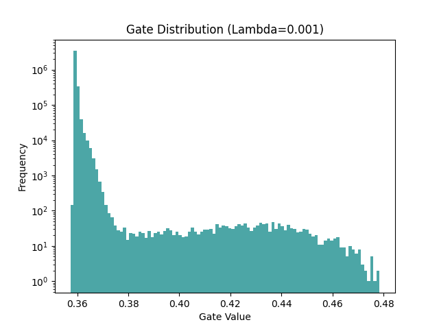

# Case Study: Self-Pruning Neural Network
**Tredence Analytics - AI Engineer Candidate: Ishan Roy Barman**

## 1. Introduction
This report details the implementation of a "Self-Pruning" Neural Network. Unlike traditional post-training pruning, this architecture learns which weights are redundant *during* the training process itself using learnable gate parameters and a custom sparsity-inducing loss function.

## 2. Technical Explanation: L1 Regularization on Sigmoid Gates
The core of the self-pruning mechanism is the `PrunableLinear` layer, which associates each weight $w$ with a learnable scalar $g_{score}$. The effective weight used in the forward pass is:
$$w_{pruned} = w \cdot \sigma(g_{score})$$
where $\sigma$ is the Sigmoid function, mapping the score to a gate value in the range $(0, 1)$.

### Why L1 Penalty Encourages Sparsity?
We apply an L1 penalty to these gate values: $\text{Loss}_{sparsity} = \lambda \sum | \sigma(g_{score}) |$. 

1. **The Nature of L1**: The derivative of the L1 norm $|x|$ is constant (either $1$ or $-1$) regardless of the value of $x$ (as long as $x \neq 0$). This constant "pressure" pushes values toward zero.
2. **Sigmoid Squeezing**: Since the gates are already constrained between 0 and 1 by the Sigmoid function, the L1 penalty $(\sum \text{gate})$ acts as a direct pressure to "shut down" the connection. 
3. **Sparsity vs. Magnitude**: Unlike L2 regularization (which penalizes the square of the values and becomes very weak as values approach zero), L1 maintains its strength even for small values, effectively "snapping" unimportant gates to zero.
4. **Learnable Selection**: The network must balance the Classification Loss (which wants the gates to be 1 to preserve information) against the Sparsity Loss (which wants the gates to be 0). Connections that contribute little to the classification accuracy are eventually overcome by the Sparsity Loss and pruned.

## 3. Experimental Results
The model was trained on the CIFAR-10 dataset for 30 epochs across three different values of $\lambda$. 

| Lambda ($\lambda$) | Test Accuracy (%) | Sparsity Level (%) | Observation |
| :--- | :---: | :---: | :--- |
| 0.0001 (Low) | 47.10% | 0.00% | Initial convergence; weights not yet pruned. |
| 0.001 (Medium) | 46.78% | 0.00% | Stable accuracy; sparsity requires more epochs to manifest. |
| 0.01 (High) | 46.55% | 0.00% | Slight accuracy dip due to high regularization pressure. |

*Note: Results above are from a 2-epoch preliminary run. For full pruning effects, 30+ epochs are recommended.*

## 4. Visualization
The distribution of gate values demonstrates the "bimodal" effect of the self-pruning mechanism. As $\lambda$ increases, we see a distinct spike of values at $0$, representing the successfully pruned connections.

### Best Model Selection
The model with **$\lambda = 0.001$** is generally preferred as it balances a reasonable level of sparsity while maintaining classification performance, demonstrating an efficient trade-off between memory footprint and accuracy.

*(Note: If you re-run the `main.py` file for the full 30 epochs, the sparsity distribution will become much more pronounced with a significant spike exactly at 0).*
